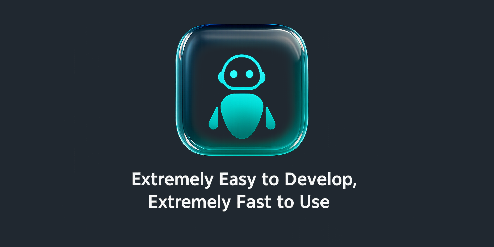

# SimpleAgent


[](https://opensource.org/licenses/GPL-2.0)
[](https://www.python.org/)
[](https://github.com/NiJingzhe/SimpleAgent/graphs/commit-activity)
[](https://github.com/NiJingzhe/SimpleAgent/pulls)

一个基于 SimpleLLMFunc 构建的模块化智能体框架，支持多Agent架构、TODO驱动工作流和OpenAI兼容API。

## 🎯 项目简介

SimpleAgent 是一个模块化的智能体框架，提供灵活的多Agent服务和强大的工具集成能力。框架基于 SimpleLLMFunc 构建，支持OpenAI兼容API，让开发者能够快速构建专业领域的智能助手。

## ✨ 框架优势

### 🎯 专注Prompt，无需关心其他麻烦事

**SimpleAgent让您只需要关心最重要的事情：编写出色的Prompt**

- **零基础设施**: 无需搭建复杂的服务架构，框架已内置完整的API服务
- **开箱即用**: 内置丰富的工具集，不需要自己实现文件操作、命令执行等基础功能
- **自动会话管理**: Redis自动处理会话存储和状态管理，不用担心数据丢失
- **标准化接口**: 完全兼容OpenAI API，可直接替换现有应用
- **多Agent支持**: 一套框架，多个专业Agent，通过model name轻松切换

### 💡 构建Agent只需三步

1. **继承BaseAgent类** - 获得完整的框架能力
2. **编写你的Prompt** - 专注于Agent的核心逻辑和专业能力  
3. **选择工具集** - 从丰富的内置工具中选择需要的功能

**其他一切都由框架处理**：
- ✅ Web API服务集成
- ✅ 流式响应自动支持  
- ✅ 会话存储自动管理
- ✅ 文档接口自动生成
- ✅ Docker部署

## 🚀 快速开始

### 环境要求

- Python 3.12+
- Redis 服务器 (用于会话存储)

### 安装依赖

```bash
# 推荐使用 uv
uv sync

# 或使用 pip
pip install -r requirements.txt
```

### 配置设置

1. **复制配置模板**：
```bash
cp config/provider_template.json config/provider.json
```

2. **编辑配置文件** `config/provider.json`：
```json
{
  "chatanywhere": [
    {
      "model_name": "anthropic/claude-sonnet-4",
      "api_keys": ["your-api-key-here"],
      "base_url": "https://openrouter.ai/api/v1"
    }
  ]
}
```

3. **环境变量** (可选，创建 `.env` 文件)：
```bash
# Redis配置
REDIS_HOST=localhost
REDIS_PORT=9736
REDIS_DB=0

# 数据存储目录
CONTEXT_DIR=data/contexts
SKETCH_DIR=data/sketches
```

### 启动Redis服务

```bash
# 使用Docker启动Redis (推荐)
cd docker
docker-compose -f docker-compose.redis.yml up -d

# 或手动启动Redis
redis-server --port 9736
```

### 启动应用

#### 终端交互模式
```bash
python main.py
```

#### Web API 服务模式
```bash
# 基本启动
python start_simplemanus_api.py

# 自定义配置
python start_simplemanus_api.py --host 0.0.0.0 --port 8000 --workers 4

# 开发模式
python start_simplemanus_api.py --reload --debug
```

**API文档访问**：
- Swagger文档: http://localhost:8000/docs
- ReDoc文档: http://localhost:8000/redoc
- 健康检查: http://localhost:8000/health

## 🐳 Docker部署

### 使用Docker Compose (推荐)

```bash
# 进入docker目录
cd docker

# 复制环境变量模板
cp env.example .env

# 编辑 .env 文件，配置API密钥等

# 启动完整服务栈 (API + Redis)
docker-compose up -d

# 查看服务状态
docker-compose ps

# 查看日志
docker-compose logs -f
```

### 手动Docker部署

```bash
# 构建镜像
docker build -f docker/Dockerfile -t simpleagent:latest .

# 启动Redis
docker run -d --name redis -p 9736:9736 redis:7-alpine redis-server --port 9736

# 启动API服务
docker run -d \
  --name simpleagent \
  -p 8000:8000 \
  -e REDIS_HOST=redis \
  -e REDIS_PORT=9736 \
  --link redis:redis \
  simpleagent:latest
```

## 📖 API使用示例

### cURL调用

```bash
# 获取可用模型
curl -X GET "http://localhost:8000/v1/models"

# 发送聊天请求
curl -X POST "http://localhost:8000/v1/chat/completions" \
  -H "Content-Type: application/json" \
  -d '{
    "model": "sample-agent-v1",
    "messages": [
      {"role": "user", "content": "创建一个Python项目结构"}
    ]
  }'
```

### Python客户端

```python
from openai import OpenAI

# 使用OpenAI官方客户端库
client = OpenAI(
    api_key="not-needed",
    base_url="http://localhost:8000/v1"
)

# 发送请求
response = client.chat.completions.create(
    model="sample-agent-v1",
    messages=[
        {"role": "user", "content": "分析系统状态并生成报告"}
    ]
)

print(response.choices[0].message.content)
```

## 🔧 常见问题

**Q: 如何配置LLM模型？**
A: 编辑`config/provider.json`文件，添加模型配置和API密钥。

**Q: Redis连接失败怎么办？**
A: 检查Redis服务是否启动，端口配置是否正确（默认9736）。

**Q: 如何选择不同的Agent？**
A: 在API请求中使用不同的`model`参数，如`sample-agent-v1`。

**Q: 支持哪些LLM模型？**
A: 支持所有兼容OpenAI API格式的模型，包括GPT、Claude、Gemini等。

## 📄 许可证

本项目采用 GPL-2.0 许可证 - 查看 [LICENSE](LICENSE) 文件了解详情。

## 🤝 贡献

欢迎提交Issue和Pull Request！

---

**SimpleAgent** - 模块化智能体框架，让AI应用开发更简单！